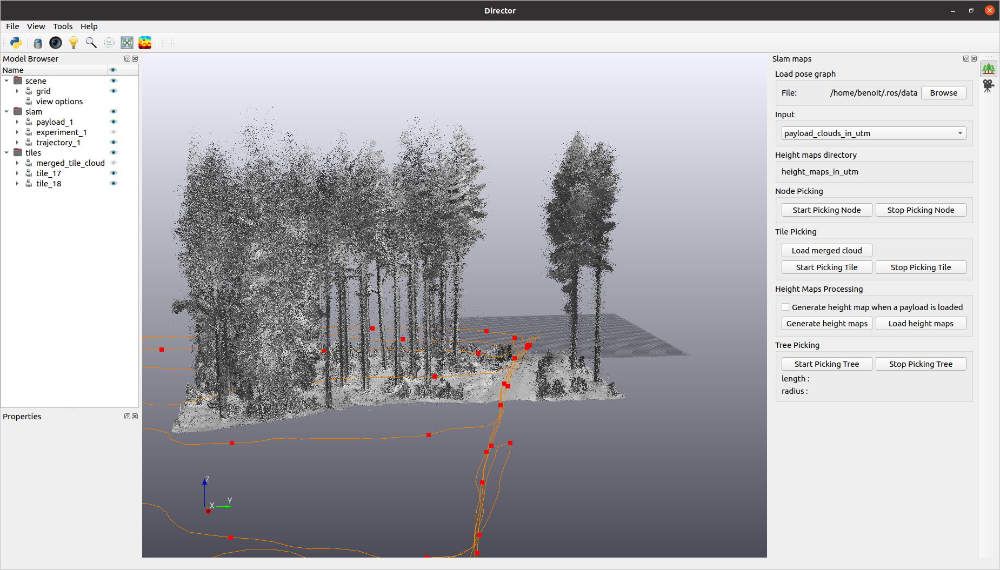

# Installation

You need to clone and build the dependencies of director, alternatively you can use a docker container : https://github.com/ori-drs/director_docker .


- `sudo apt install libpcl-dev python3-pip ros-noetic-pcl-ros libqwt-qt5-dev qtscript5-dev qtbase5-private-dev qtmultimedia5-dev python3-pyqt5`
- `pip3 install Cython numpy==1.23.4 lxml utm pymap3d`

Clone and build python-pcl manually
- `git clone https://github.com/ori-drs/python-pcl.git`
- `cd python-pcl`
- `python3 setup.py build_ext --inplace`
- `python3 setup.py install`

Clone director and the others dependencies

- `git clone https://github.com/ori-drs/director_digiforest.git`
- `git clone https://github.com/ori-drs/PointCloudLibraryPlugin`
- `git clone https://github.com/ori-drs/director_digiforest.git`
- `git clone https://github.com/ori-drs/cv_utils.git`
- `git clone https://github.com/ori-drs/ctkPythonConsole.git`
- `git clone https://github.com/ori-drs/PythonQt.git`
- `git clone https://github.com/ori-drs/QtPropertyBrowser.git`
- `git clone https://github.com/ori-drs/digiforest_drs.git`

Build the package :
- `catkin build director_digiforest`

# Usage 

```
roslaunch director_digiforest digiforest.launch
```

# Load a project

Open the `Forestry` panel by clicking on the forest icon located near the top right corner of the window. Under `Load Pose Graph` click on `Load` and select the directory that contains the pose graph file. The pose graph will appear.


The payload nodes are in red. You can visualize all the nodes of the pose graph by clicking on `experiment` in the `Model Browser` on the left panel.

## Load payload point clouds

Once a project is loaded, you can load individual payload clouds by clicking first on the `Start Picking Node` button and then on the payload node itself. After a few seconds the payload cloud will be loaded.


To load another cloud, repeat the same procedure by cliking again on `Start Picking Node`.

## Load tiles

To load the tiles, you have to make sure that your project directory has a `Tiles` folder containing the tiles point cloud. In the Forestry panel, under the `Tile Picking` section, load a downsampled combined point cloud of all the tiles; it is helpful to load the tiles of interest. To load a tile, click on the `Start Picking Tile` button and then click on a point of the combined cloud that you are interested in, the tile containing this point will be loaded. Click on `Stop Picking Tile` to hide the combined point cloud and stop the tile picking process.



## Load height maps

It's possible to generate a height map from the payload clouds. To enable this feature, make sure that the `Generate height map when a payload is loaded` checkbox is checked in the Forestry panel. Be aware that this terrain mapping generation take time and will slow down the payload cloud loading. All the height maps can be generated all at once ( without loading them ) by clicking on `Generate height maps`. They can be loaded all at once by clicking on `Load height maps`.


## Useful features

A point cloud can be colorised by height by selecting the cloud in the `Model Browser` and clicking on the `Color Cloud` button on the top bar.


# History

This repo (from Oxford Dynamic Robot Systems Group) is a fork of the original [Director master](https://github.com/RobotLocomotion/director). Originally Director was developed as the primary user interface used by Team MIT in the DARPA Robotics Challenge.

[](https://www.youtube.com/watch?v=em69XtIEEAg)

This previous version was heavily integrated with Drake and did not use ROS. It continues to be developed as the user interface for Drake by Toyota Research Institute. [Link to RobotLocomotion/TRI's version of Director](https://github.com/RobotLocomotion/director).

In addition to Atlas, its been used to operate ANYmal in Oxford Dynamic Robot Systems Group, [NASA's Valkyrie](https://www.youtube.com/watch?v=AjSP8iZyhTE), a Clearpath Husky with [two RE2 arms](https://www.youtube.com/watch?v=_t1c_lrEH1k) and another with [two UE5 arms](https://www.youtube.com/watch?v=1OyAzHcDL5M).

# Citing

If you wish to cite the Director, please use this publication from the MIT DARPA Robotics Challenge Team:

    @article{2017JFR_marion,
      title = {Director: A User Interface Designed for Robot Operation With Shared Autonomy},
      author = {Pat Marion and Maurice Fallon and Robin Deits and Andr\'{e}s Valenzuela and
      Claudia P\'{e}rez D'Arpino and Greg Izatt and Lucas Manuelli and
      Matt Antone and Hongkai Dai and Twan Koolen and John Carter and
      Scott Kuindersma and Russ Tedrake},
      journal = "J. of Field Robotics",
      year = 2017,
      month = mar,
      volume = 34,
      issue = 2,
      pages = {225-426},
    }
